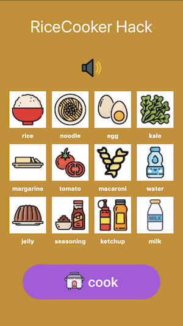

## WWDC20 Swift Student Challenge - Rice Cooker Hack

    
    

### [Demo](https://youtu.be/0fgdYEAn6MQ)

### Requisites

* MacOS 10.15.4
* Xcode 11.4.1

### Introduction

This is the playground I submitted for WWDC20 Swift Student Challenge. It's also my first time applying for WWDC Submission.

I spend about four full days to complete this playground. I give my playground the name “Rice Cooker Hack", because this playground illustrates how to cook using minimum ingredients and maximize rice cooker. I got this idea since i am living in the room with only rice cooker that can i use to cook.

### Description

The topic of my Playground is "What can rice cooker do?". Some people know that rice cooker can cook rice, but only a few people know that rice cooker can cook a lot of meals. The aim of this Playground is help people to experiment with ingredients and combine it become meal. if the ingredients is right the alert with food name and fun sound effect will appear, if not you can try again. 

### Third party resource used:

- Music background: Goat by Wayne Jones from [Youtube Audio Library](https://www.youtube.com/audiolibrary/music). The sound is good and represent joyful when playing game. i used it as my background music.
- Sound Effect: click, kids cheering and failed sound effect from [Zedge](https://zedge.net). the sounds effect will make my game more cheerful and interactive. i used the sound effect for audio feedback when user click ingredients card & cook button. 
- Icon : All the icon in this game come from [Flaticon]( www.flaticon.com), with some author like [Monkik](https://www.flaticon.com/authors/monkik), [Freepik](https://www.flaticon.com/authors/freepik) and [Pixel Perfect](https://www.flaticon.com/authors/pixel-perfect)
